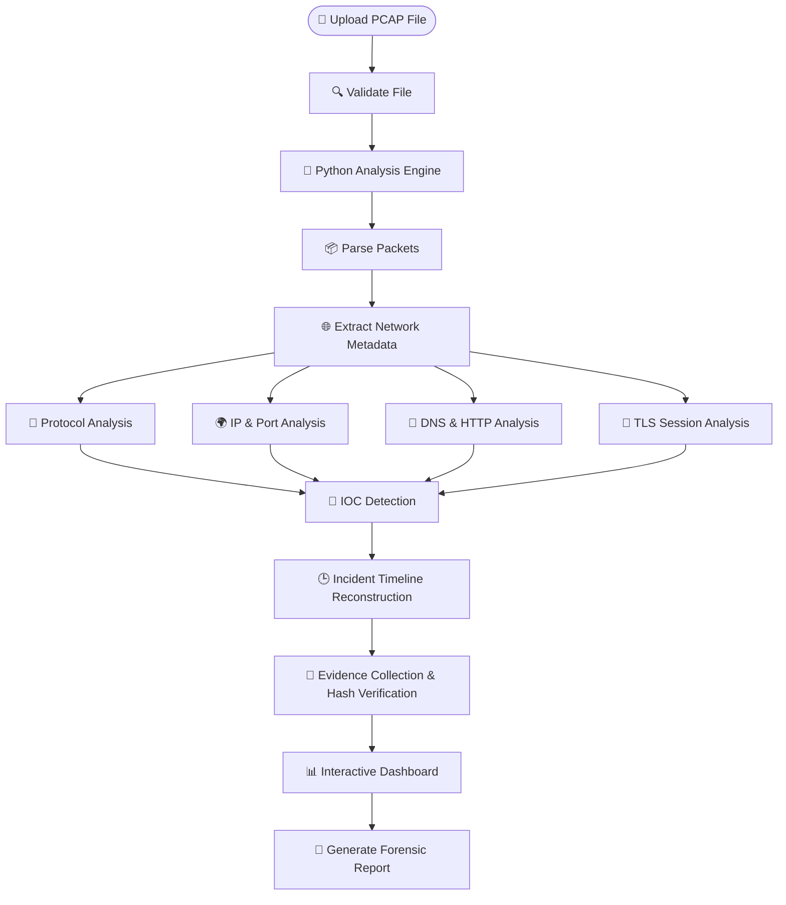

# 🚀 NetRace – Network Forensics & Incident Reconstruction Platform

> **Trace Every Packet. Reveal Every Attack.**

NetRace is a Python-powered Network Forensics and Incident Reconstruction platform designed to analyze **PCAP (Packet Capture)** files. It helps cybersecurity professionals, SOC analysts, and digital forensic investigators detect threats, reconstruct attack timelines, identify Indicators of Compromise (IOCs), and generate forensic reports through an interactive web dashboard.

---

## ✨ Features

- 📂 Upload and analyze PCAP files
- 🔍 Deep Packet Inspection (DPI)
- 🌐 Protocol analysis (TCP, UDP, HTTP, HTTPS, DNS, ICMP, TLS)
- 🚨 Indicators of Compromise (IOC) Detection
- 📊 Interactive dashboard with network statistics
- 📈 Traffic visualization and protocol distribution
- ⏱️ Incident timeline reconstruction
- 📁 Evidence Vault with SHA-256 verification
- 📑 Automated forensic report generation
- 🗂️ Investigation case management
- 🔐 Secure user authentication

---

## 🖥️ Dashboard Preview

### Command Center

### Packet Analyzer

### IOC Detection

### Evidence Vault

### Investigation Report

---

## 🛠️ Tech Stack

### Frontend
- React.js
- TypeScript
- Tailwind CSS

### Backend
- Python
- FastAPI

### Packet Analysis
- PyShark
- Scapy
- TShark (Wireshark Engine)

### Database
- MongoDB

---
## 🔄 NetRace Analysis Workflow

## 📊 Dashboard Modules

- Command Center
- Investigation Cases
- Incident Workbench
- Packet Analyzer
- IOC Detection
- Evidence Vault
- Forensic Reports
- User Profile
- Platform Settings

---

## 🎯 Target Users

- SOC Analysts
- DFIR Investigators
- Incident Responders
- Malware Analysts
- Security Researchers
- Cybersecurity Students

---

## 🚀 Future Enhancements

- Live packet capture
- AI-assisted threat detection
- Threat Intelligence integration
- MITRE ATT&CK mapping
- PDF report export
- Multi-user collaboration
- Real-time monitoring

---

## 📄 License

This project is licensed under the MIT License.

---

⭐ **If you find NetRace useful, please consider giving this repository a star!**
